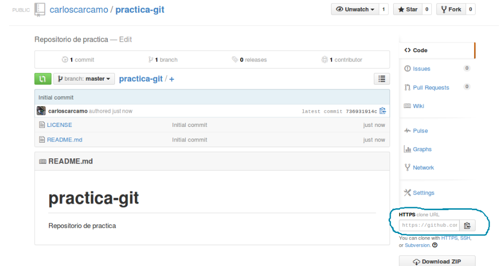

##CLONANDO REPOSITORIOS
La imagen a continuación nos muestra la información de nuestro recién creado repositorio, pongamos atención al área marcada con azul __”HTTPS clone URL”__, esa área nos da el vinculo directo a nuestro repositorio con el cual podemos clonarlo a nuestro ordenador y poder entonces trabajar sobre el, enviando cambios (push) y obteniendo las actualizaciones más recientes del repositorio (pull).



Comencemos entonces con la practica, copiemos el vinculo “clone url” y abramos una terminal y ejecutemos el comando clone:

```
$ git clone https://github.com/carloscarcamo/practica-git.git 
Cloning into 'practica-git'... 
remote: Counting objects: 4, done. 
remote: Compressing objects: 100% (4/4), done. 
remote: Total 4 (delta 0), reused 0 (delta 0) 
Unpacking objects: 100% (4/4), done.
$ cd  practica-git
$ ls
LICENSE  README.md
```

Hemos clonado exitosamente nuestro repositorio a nuestro ordenador, luego entramos al directorio y listamos los archivos que tenemos dentro, efectivamente podemos observar que tenemos dos archivos LICENSE y README que son los que se añadieron al momento de crear nuestro repositorio en github. 

Podemos ver a que url apunta nuestro repositorio remoto usando git remote -v, así:

```
$ git remote -v
origin	https://github.com/carloscarcamo/practica-git.git (fetch) 
origin	https://github.com/carloscarcamo/practica-git.git (push)
```

Git nos informa de la url a la que nuestro repositorio hará los respectivos [push](http://git-scm.com/docs/git-push) y [pull](http://git-scm.com/docs/git-pull).
