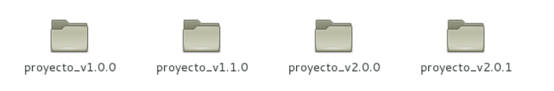

#SISTEMAS DE CONTROL DE VERSIONES

Los sistemas de control de versiones son aquellos que se encargan de registrar los cambios realizados sobre un archivo o un conjunto de archivos a lo largo del tiempo, con el objetivo de mantener un control sistemático permitiendo así en un futuro recuperar versiones especificas del o los archivos modificados. 

Es muy común encontrarse con la situación donde se crea un archivo y luego se modifica perdiendo los cambios hechos antes de la ultima actualización; hay una forma de evitar el problema anterior y esta es haciendo una copia local, renombrarla y hacer los cambios en el nuevo archivo manteniendo la integridad del archivo original, pero, ¿que pasa si se han hecho 5 cambios bastante significativos al archivo? Habría que crear 5 copias diferentes ¿y si trabajo en equipo y cada persona modifica una parte del archivo?, esta situación se vuelve complicada y poco eficiente, la imagen a continuación muestra esta situación:

¿Y si no solo es un simple archivo sino un proyecto grande con diferentes módulos y varias personas trabajando sobre este?

El problema de tener este tipo de control, poco eficiente, radica en que puede causar serios conflictos debido a que cada usuario debe entregar sus modificaciones a los demás y viceversa y cada uno de estos debe ordenar sus archivos, teniendo cuidado de no sobrescribir algún archivo o directorio, y ¿que pasa si por error mi disco duro colapsa y no tuve tiempo de entregar mis ultimas modificaciones?, tengo que volver a hacer los cambios! o si quien lleva control del sistema pierde la información... que triste situación, cuantas copias deberé crear, cuanto tiempo invertiré copiando, pegando, renombrando, etc. 

