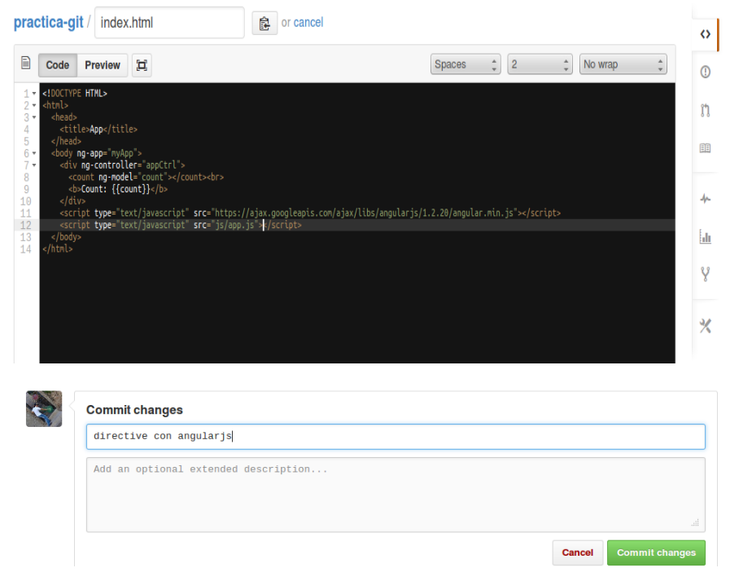
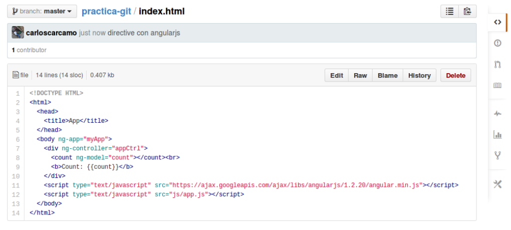
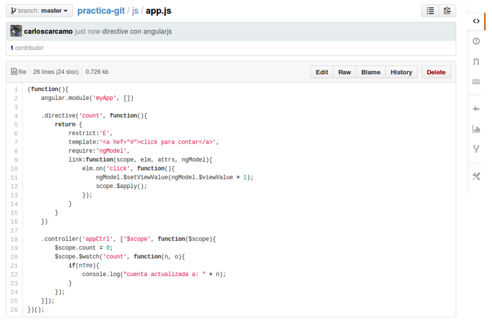

##OBTENIENDO CAMBIOS DEL REPOSITORIO REMOTO

Que pasa si el repositorio ha cambiado como puedo obtener los cambios más recientes?, eso es fácil, simplemente hacemos un pull al repositorio de origen. 
Para este ejemplo vamos a editar los archivos en internet desde github. 

Seleccionemos uno de los archivos para editar, las imágenes a continuación muestran el proceso de edición de un archivo desde github:


Una vez seleccionado el archivo que queremos editar, veremos una barra de botones como el de la imagen anterior. 

Hacemos click al boton “edit” el cual nos mostrara una pantalla donde podemos editar nuestros archivos.



Github nos ofrece una interfaz muy sencilla para editar y hacer commit en linea. El resultado final lo podemos ver en la siguiente imagen:



Haremos lo mismo para editar el script en “js/app.js”, el resultado sera:



Podemos ver en github los commit que hemos hecho hasta ahora:


Para saber si necesitamos hacer un pull al repositorio remoto, vamos a ejecutar el comando:

```
$ git remote update 
Fetching origin 
remote: Counting objects: 10, done. 
remote: Compressing objects: 100% (6/6), done. 
remote: Total 7 (delta 1), reused 0 (delta 0) 
Unpacking objects: 100% (7/7), done. 
From https://github.com/carloscarcamo/practica-git 
   19118ae..2a6236c  master     -> origin/master 
$ git status 
# On branch master 
# Your branch is behind 'origin/master' by 2 commits, and can be fast-forwarded. 
# 
nothing to commit (working directory clean) 
```

Con git remote update actualizamos todas las referencias de los objetos, ramas y demás que tengamos de nuestro repositorio remoto en nuestro repositorio local, luego ejecutamos __git status__ y este nos dice que nuestra rama actual esta desactualizada respeto a la rama remota. 
Tambien podriamos haber usado otro comando llamado __fetch__ para obtener el mismo resultado anterior:

```
$ git fetch origin
```

git remote update y git fetch origin nos daran los mismos resultados, pero algunas cosas pueden variar internamente, para más información visitar la documentación oficial de [git remote](http://git-scm.com/docs/git-remote) y [git fetch](http://git-scm.com/docs/git-fetch)

Vamos a actualizar nuestra repo local con los cambios hechos en github, esto lo haremos con un __pull__ de la siguiente manera:

```
$ git pull origin
From https://github.com/carloscarcamo/practica-git 
 * branch            master     -> FETCH_HEAD 
Updating 19118ae..2a6236c 
Fast-forward 
 index.html |   14 ++++++++++++++ 
 js/app.js  |   26 ++++++++++++++++++++++++++ 
 2 files changed, 40 insertions(+)
$ git status 
# On branch master 
nothing to commit (working directory clean)
```

Hemos actualizado nuestro repositorio local con los cambios hechos en github, utilizamos ```git pull «remote»``` en donde especificamos  la rama remota.

Ejecuta los comandos siguientes y verifica su salida, veras que en efecto tienes los archivos actualizados.

```
$ cat index.html
$ cat js/app.js
```

El proceso de trabajo con repositorios remotos es siempre similar al que hemos hecho en este tutorial usando github.

__¿y esto es todo?__ Pues no, este tutorial es solamente una pequeña introducción, ahora queda a criterio del lector indagar más en la documentación, practicar, y trabajar con git en sus futuros proyectos.

_«Recuerda que si deseas extender este tutorial, no dudes en hacerlo, solo asegúrate de compartirlo con los demás.»_


