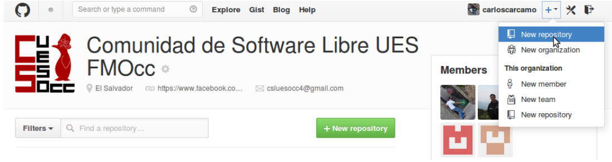
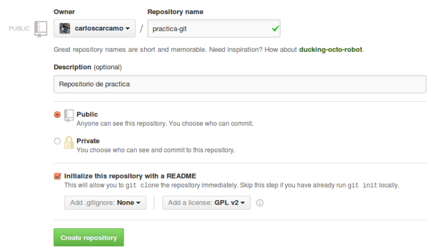

##CREANDO UN REPOSITORIO EN GITHUB

Vamos a comenzar por crear un repositorio en github con el cual trabajaremos a lo largo de este tutorial, a continuación te mostramos los pasos necesarios:

En el menú superior derecho luego de tu nombre de usuario encontraras una serie de opciones como muestra la imagen siguiente:

Damos click a la opción crear nuevo repositorio  y nos aparece una pantalla similar a la siguiente:

Procedamos entonces a crear nuestro primer repositorio en github, llenamos el formulario con los datos que queramos y damos click al botón “create repository”, nos mostrara una pantalla con una serie de opciones para el manejo de nuestros repositorios, es buena idea navegar un poco esta interfaz y ver que opciones nos ofrece github.