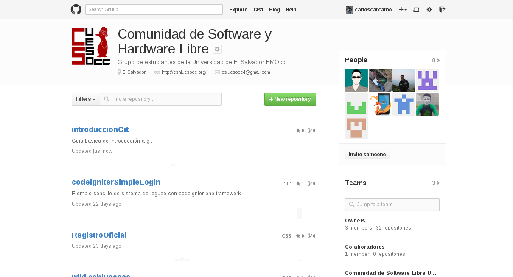

# REPOSITORIOS REMOTOS

Como se menciono al principio de este tutorial, existen varios sitios en internet que ofrecen servicios de alojamiento de código y que permiten utilizar git para llevar control de nuestros proyectos. En este apartado usaremos uno de los sitios más famosos en el mundo para alojar código, hablamos de github.com , github nos ofrece alojamiento gratuito de código entre muchas  otras interesantes opciones, también ofrece servicio privado para empresas o individuales que quieran mantener sus repositorios en privado, nosotros, como debe ser, tenemos una cuenta en github donde publicamos código open source que puede ser clonado, pueden hacer un fork contribuir directamente, etc. 

Veamos como luce entonces la interfaz de github (interfaz para organizaciones en nuestro caso):

